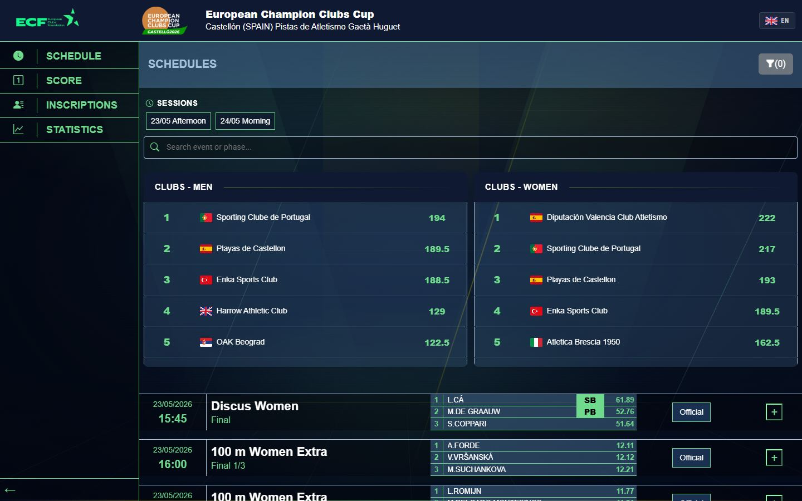
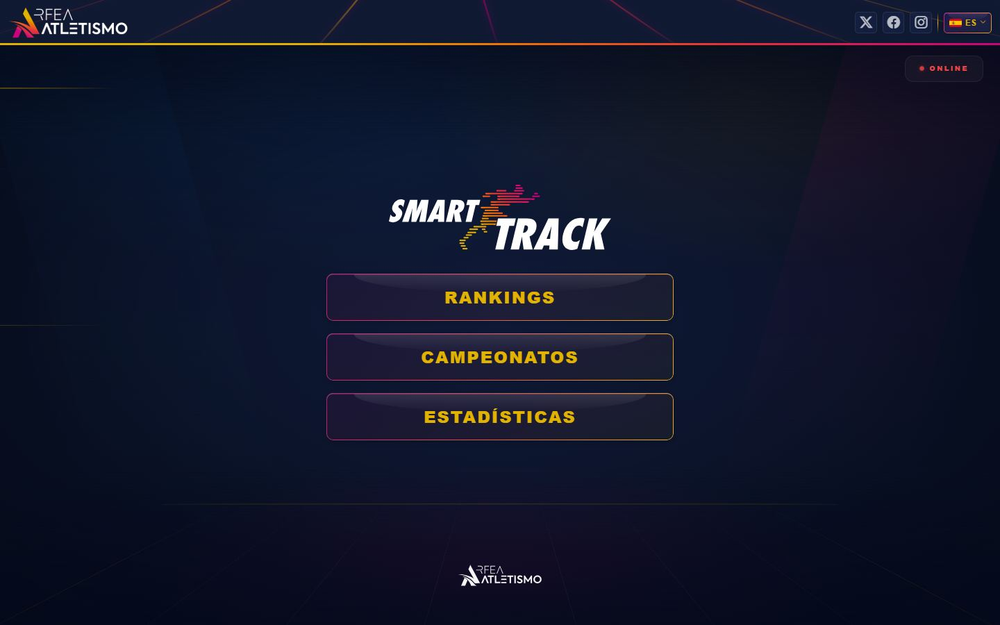
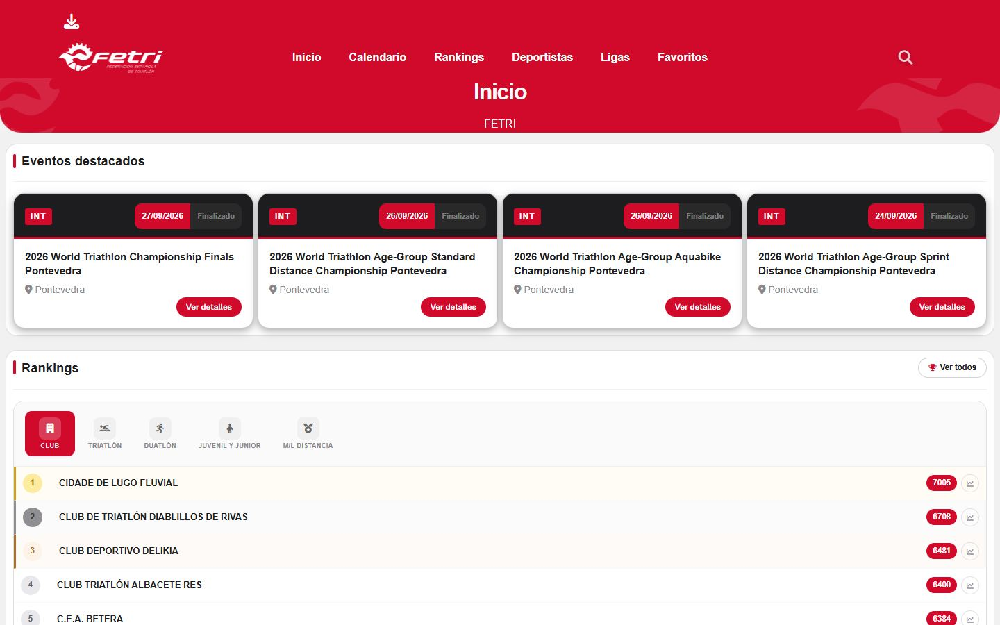

<a href="https://valentinpreutesei.com">
  <picture>
    <source media="(prefers-color-scheme: dark)" srcset="assets/hero-dark.svg">
    
  </picture>
</a>

  <a href="https://valentinpreutesei.com"><b>Portfolio</b></a> ·
  <a href="https://www.linkedin.com/in/valentinpreutesei/">LinkedIn</a> ·
  <a href="mailto:valentinpreutesei@gmail.com">Email</a> ·
  <a href="https://www.credly.com/badges/12e61e45-7da2-4cec-bb6a-26756f2a46f7/linked_in?t=sx0je3">AWS Certified Developer – Associate</a> ·
  Madrid · ES / RO / EN

I build SaaS products end to end: APIs, payments, cloud infrastructure and the interface on top. Right now I'm a Full Stack Developer at **Forus Green**. Before that I was technical lead of a three-person team shipping live results and payment platforms for sports federations.

<picture>
  <source media="(prefers-color-scheme: dark)" srcset="assets/impact-dark.svg">
  
</picture>

## Now · Forus Green

**AllUPay** is a serverless SaaS on AWS that combines document signing and payment in a single flow.

- **2 s → 300 ms.** Replaced sequential reads with DynamoDB `BatchGetItem`, retrying the unprocessed keys of every batch, so every read completes even when part of a batch fails.
- **No double charges.** Payment and PSD2 open-banking webhooks are idempotent, with DynamoDB keys and conditional writes.
- **Product.** Owned the redesign and new brand identity, and the Stripe subscription system with per-plan feature gating.

## Before · Conersys Sport Solutions

Full Stack Developer & Technical Lead. Platforms for Spanish and European sports federations: licences, registrations, payments with Redsys and Ceca, tax agency integration and live results.

<picture>
  <source media="(prefers-color-scheme: dark)" srcset="assets/live-dark.svg">
  
</picture>

Also: graphics (CG) operator for Olympic Broadcasting Services on wheelchair curling at the **Milano Cortina 2026 Paralympic Games** ([post](https://www.linkedin.com/posts/valentinpreutesei_milanocortina2026-paralympics-curling-ugcPost-7437904466907058176-1loQ/)).

### In production

<table>
  <tr>
    <td width="33%" valign="top">
      
       <b><a href="https://ecf.conersyslive.es/">ECF Live</a></b>
       European Champion Clubs Cup, Castellón 2026. Redesign I led.
    </td>
    <td width="33%" valign="top">
      
       <b><a href="https://rfealive.es/">RFEA Live</a></b>
       Live results for the Spanish Athletics Federation.
    </td>
    <td width="33%" valign="top">
      
       <b><a href="https://live2025.fetri.es/">FETRI Live</a></b>
       Live results for the Spanish Triathlon Federation.
    </td>
  </tr>
</table>

## Stack

<picture>
  <source media="(prefers-color-scheme: dark)" srcset="assets/stack-dark.svg">
  
</picture>

## Side projects

| Project | What it is | Code |
| --- | --- | --- |
| **Portfolio** | React 19, TypeScript and Vite, with a playable orbital mechanics game, a 3D mode and a terminal (try <kbd>Ctrl</kbd> <kbd>K</kbd>). | [valentinpreutesei.com](https://valentinpreutesei.com) |
| **AlmFit** | Nutrition tracking web app, built as my final project. React and Vite frontend, Java and Spring Boot backend. | [Backend](https://github.com/valentintic/BackEndTFG) · [Frontend](https://github.com/valentintic/FrontEndTFG) |
| **Serverless .NET** | C# on AWS Lambda, deployed with an AWS SAM template. | [AWSLambdaExamen](https://github.com/valentintic/AWSLambdaExamen) |

Happy to talk SaaS, payments or backend on AWS: <a href="https://www.linkedin.com/in/valentinpreutesei/">LinkedIn</a> or <a href="mailto:valentinpreutesei@gmail.com">email</a>.
