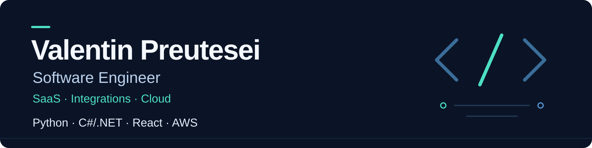

**Based in Spain · English & Spanish**  
[LinkedIn](https://www.linkedin.com/in/valentinpreutesei/) · [Email](mailto:valentinpreutesei@outlook.es) · [AWS certification](https://www.credly.com/badges/12e61e45-7da2-4cec-bb6a-26756f2a46f7/linked_in?t=sx0je3)

## What I build

I'm a software engineer building **SaaS products, API integrations and business applications** with Python, C#/.NET, React and AWS.

My professional experience spans **fintech and sports technology**: document processing, subscriptions and usage controls, payment and open-banking integrations, live competition results, championship registrations and CRM workflows.

I work across backend services, frontend interfaces and cloud infrastructure, with attention to authentication, reliable event handling, automated tests and CI/CD.

## Technical focus

| Area | Technologies |
| --- | --- |
| Backend | Python · C# / .NET |
| Frontend | React · Next.js · TypeScript |
| Cloud | AWS Lambda · API Gateway · DynamoDB · S3 · AWS SAM |
| Quality & delivery | pytest · GitHub Actions · Git · Docker |

Also used in projects and training: **Java / Spring Boot, Terraform and Kubernetes**.

**AWS Certified Developer – Associate** · [View credential](https://www.credly.com/badges/12e61e45-7da2-4cec-bb6a-26756f2a46f7/linked_in?t=sx0je3)

## Selected public projects

These repositories showcase personal and academic work.

| Project | Focus | Code |
| --- | --- | --- |
| **AlmFit — nutrition web app** | Academic full-stack project for managing daily nutrition and food intake. React / Vite frontend and Java / Spring Boot backend. | [Backend](https://github.com/valentintic/BackEndTFG) · [Frontend](https://github.com/valentintic/FrontEndTFG) |
| **Serverless .NET practice** | Learning project using C# and AWS Lambda, with an AWS SAM template. | [AWSLambdaExamen](https://github.com/valentintic/AWSLambdaExamen) |
| **Personal portfolio** | Portfolio application built with React and Vite. | [PortfolioDev](https://github.com/valentintic/PortfolioDev) |

## Let's talk

Interested in SaaS development, API integrations or automating a business workflow? **[Connect on LinkedIn](https://www.linkedin.com/in/valentinpreutesei/)** or [send me an email](mailto:valentinpreutesei@outlook.es).
